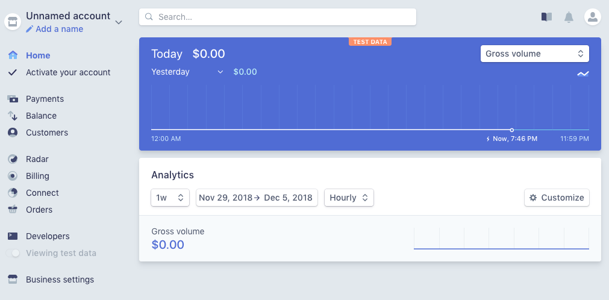
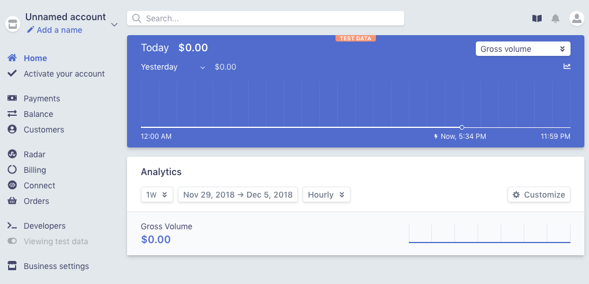

Rebuild of the Stripe Dashboard with Tailwind CSS and Vue.js
============================================================

I used the utility-first CSS framework [Tailwind](https://tailwindcss.com/) to rebuild the [Stripe dashboard](https://dashboard.stripe.com/test/dashboard). It's as responsive as the orginal dashboard but non-functional (no tooltips or buttons). I mainly used font-awesome for the icon, although I stole a few from Stripe.

